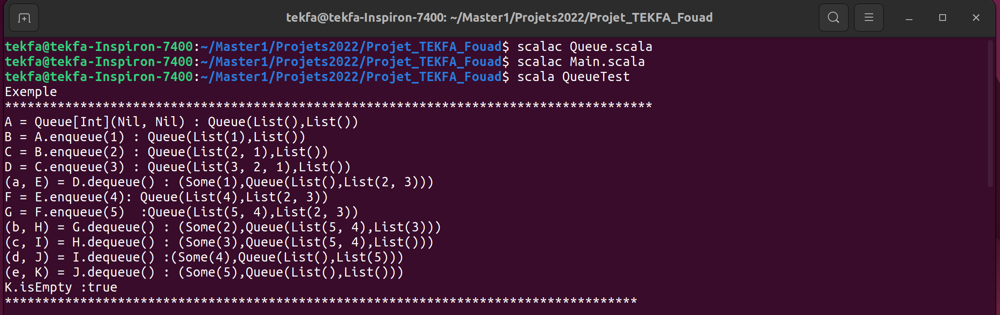
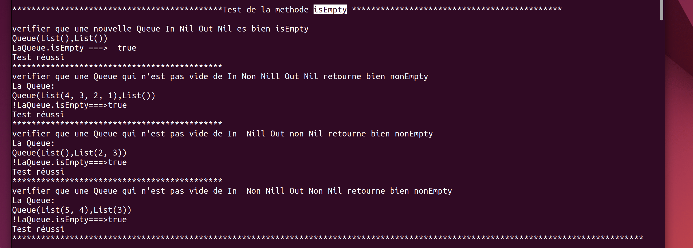
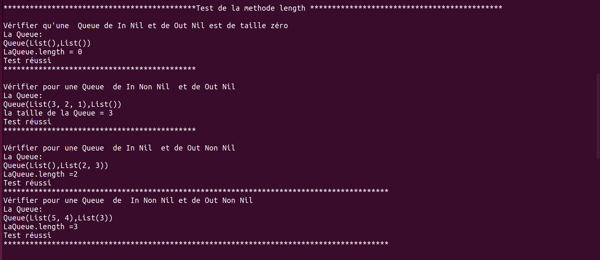
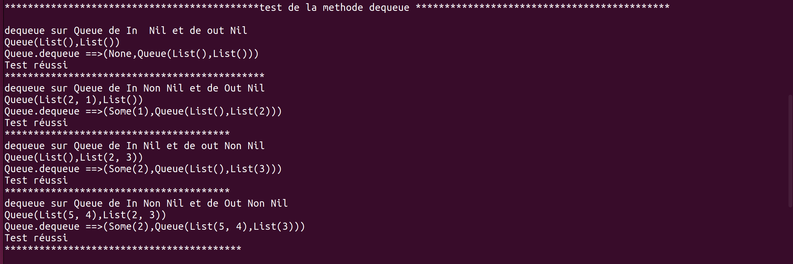
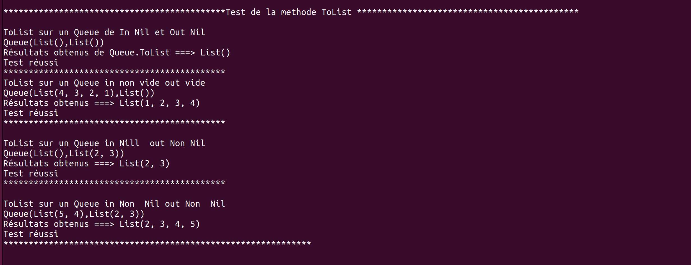
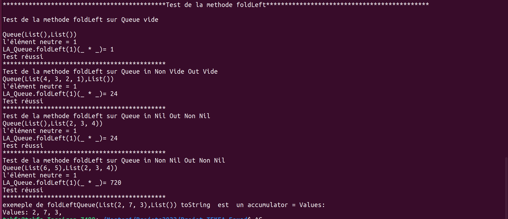
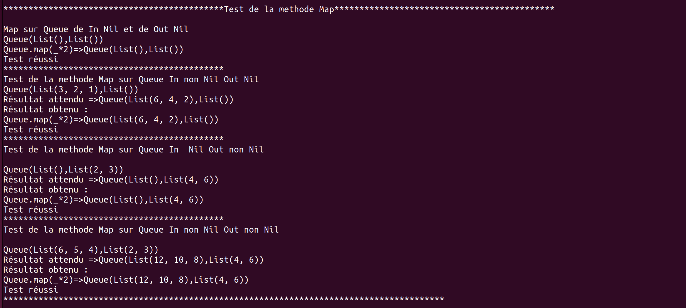

#  Une classe liste FIFO en scala 
- Fouad TEKFA
- M1 IWOCS
- 2022-2023

**scala Version := "2.11.12"**

Nous souhaiterions mettre en place une liste spécifique permettant un accès FIFO (first-in, first-out) c’est-à-dire une liste
dans laquelle on peut retirer le dernier élément en temps raisonnable. Une telle liste est souvent appelée « queue ». Nous
souhaiterions en outre conserver l’accès au premier élément en temps constant.

Une façon de faire cela consiste à utiliser en interne deux listes nommées in et out, entrée, et sortie. La liste d’entrée reçoit
les éléments que l’on ajoute au fil du temps. La seconde reste vide tant que l’on n’a pas besoin de retirer d’élément à la
fin. Dès que cette occasion se présente, on inverse la liste d’entrée et on l’assigne à la sortie, la liste d’entrée devient alors
vide.

L’opération d’inversion ne se produit en retirant les éléments à la fin que si la liste de sortie est vide. C’est pourquoi on dit
que la structure fonctionne en temps constant « amorti »

# Résulta obtenue : 
 ## Exemple :

 ## Méthode isEmpty :

 ## Méthode length : 

 ## Méthode dequeue :

 ## Méthode ToList:

 ## Méthode foldLeft:

 ## Méthode Map :

 ## Méthode headOption :

 ## Méthode rearOption

